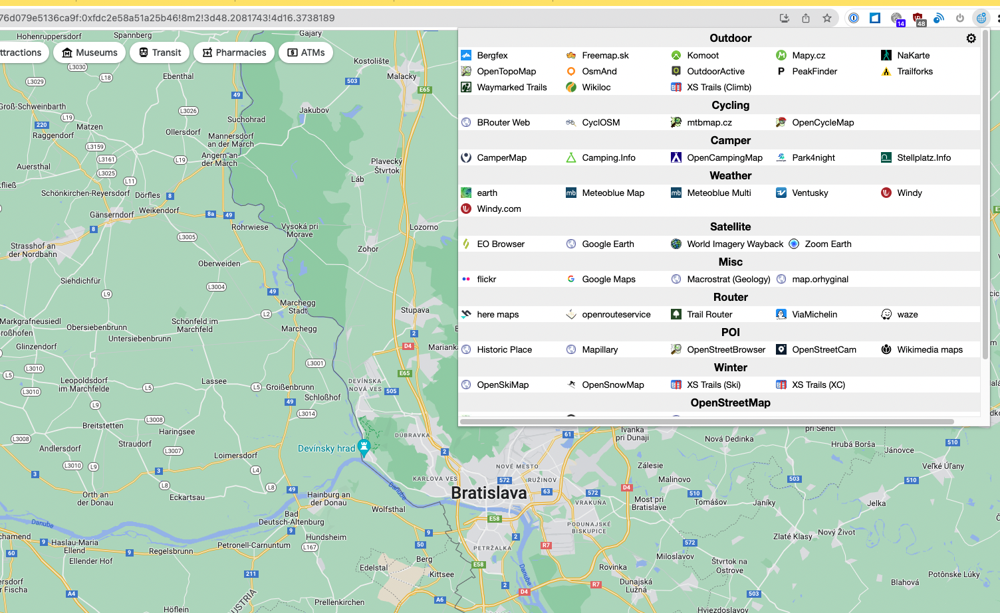
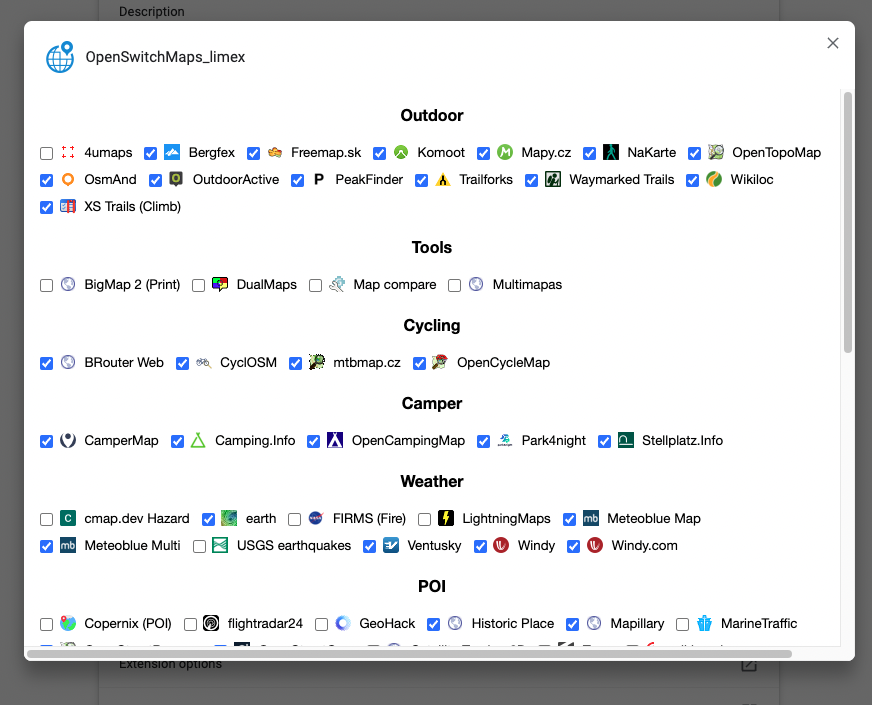

# OpenSwitchMaps

Map service switcher for Chrome/Firefox extension
Greatly contributed by jazzzz.
This is a fork from . Kudos for the great work!! Thanks! A very good foundation for my fork!

## Motivation for fork (New Features & Fixes)

- Some cleanup done. Added new maps
- Most of the maps didn't calculate the lat/lon/zoom calculation that is needed to open a new map from.
- Chanced the Categories, because some grew to big, while others remained small.
- Switched behavour in the Map Popup: Left Click now opens in new Tab, Middle Click opens in same Tab
- Sorted the Maps by Name
- Show Descriptions while MouseOver in Options Popup
- Existing Extension was listing the Categories in Columns. This limited the number of Categories.
  Also was a waste of space with smaller Categories. 
  Solution: Render Categories in rows

## Install

you have 3 options ...

### a) from Browser plugin

- (sorry this is outdated, because updating to Marketplace is an time expensive manual task I'm currently not willing to do) [Chrome webstore](https://chrome.google.com/webstore/detail/openswitchmapslimex/koidglegkmmddlpoigdfmblkjnfhibeb)
- (also outdated) [Firefox addon center](https://addons.mozilla.org/firefox/addon/openswitchmaps_limex/)
- Opening the Dialogs on _first_ click take some seconds to show up. Be patient. :)

### b) from source code

This extention uses Node.js

1. Install Node.js
1. Install the dependencies: npm install
1. Build the extension: npm run build
1. The extension is built in the `dist` directory
1. Add to your Chrome/Firefox
   - Chrome: chrome://extensions/ -> Load unpacked
1. Optional:

   Increase the build version before 'Build the extension' in Powershell (if needed):
   - Set-ExecutionPolicy -ExecutionPolicy RemoteSigned -Scope Process    (optional in case of security warning)
   - .\inc_patch.ps1

### c) Load unpacked dist directory from github

1. Download the /dist Directory from github (Clone the Code or Code -> Download ZIP) to a Directory of of your choice
1. Add to your Chrome/Firefox
   - Chrome: chrome://extensions/ -> Load unpacked

## How to use

1. Open Google map, for example (https://www.google.de/maps/place/Vienna/@48.2092464,16.850411,11z)
1. You will see an earth icon near URL bar. Click it.
1. Select OpenStreetMap, for example.
1. You can jump to OpenStreetMap at the same position
1. Left click: Open in a new tab. Middle click: Open the same tab.

## Settings

Show/hide maps:

1. Right click the earth icon,
1. Select "Options"
1. It might take some seconds for the popup to apear. Collecting all the data takes some time.
1. Check/uncheck each map to show/hide it.

## ToDo

- ??

## Screenshots

## Current (2022/09/20) supported map services

1. 4umaps: Topo, Trail difficulty; Outdoor
1. Bergfex: Topo, Tracks, Tourism; Outdoor
1. BigMap 2 (Print): Obtain a composed big map image; Tools
1. BRouter Web: Misc Maps, Custom Layer Overpass & XYZ; Cycling
1. CamperMap: Camper POIs; Camper
1. Camping.Info: like Stellplatz.info; Camper
1. cmap.dev Hazard: Realtime disaster damage estimation; Weather
1. Copernix (POI): Show POIs from Wikipedia; POI
1. CyclOSM: for Cyclists; Cycling
1. DualMaps: synchronized Maps, Aerial & Street View; Tools
1. earth: Wind, Ocean, Chem, Particulates; Weather
1. EO Browser: Satellite sensing image viewer; Satellite
1. FIRMS (Fire): Realtime fire information of satellite observation; Weather
1. flickr: Geotagged image search; Misc
1. flightradar24: Airplane tracker; POI
1. Freemap.sk: Map and Features for Sk; Outdoor
1. GeoHack: Map links for Wikipedia articles; POI
1. Google Earth: undefined; Satellite
1. Google Maps: undefined; Misc
1. here maps: undefined; Router
1. Historic Place: Historic objects; POI
1. KeepRight: OpenStreetMap QA tool; OpenStreetMap
1. Komoot: Discover & Plan for multiple Sports; Outdoor
1. Kontur: See most active OSM contributor; OpenStreetMap
1. Latest OSM Edits per Tile: Latest OpenStreetMap Edits per Tile; OpenStreetMap
1. Launch RapiD editor: Facebook AI assisted OSM editor; OpenStreetMap
1. Level0 Editor: low-level OSM Editor; OpenStreetMap
1. LightningMaps: Realtime lightning map; Weather
1. Macrostrat (Geology): Geological map; Misc
1. Map compare: Compare maps side-by-side; Tools
1. map.orhyginal: Portal of many map services; Misc
1. Mapillary: Crowdsourced street-level imagery available as CC BY-SA; POI
1. Mapy.cz: Outdoor with geotagged Pics; Outdoor
1. MarineTraffic: Ship tracker; POI
1. Meteoblue Map: 7d Forecast, Maps Wind, Snow, Waves, Rain, ...; Weather
1. Meteoblue Multi: Multi Model 7d Forecast; Weather
1. mtbmap.cz: Mountain Bike Map; Cycling
1. Multimapas: Compare maps by overlay; Tools
1. NaKarte: Heatmaps, Panorama, Streetview, ...; Outdoor
1. Old maps online: undefined; Misc
1. Open Infrastructure: World's hidden infrastructure (Train, Power, Mobile, ...); Misc
1. OpenAerialMap: undefined; Satellite
1. OpenCampingMap: Camping Sites; Camper
1. OpenCycleMap: Cycling map; Cycling
1. OpenGeofiction: Crowdsoured fictional map; Misc
1. OpenHistoricalMap: Crowedsourced Historical map; Misc
1. OpenRailwayMap: undefined; Misc
1. openrouteservice: undefined; Router
1. OpenSeaMap: focus on nautical info; Misc
1. OpenSkiMap: Ski Slopes, Nordic Ski Trails; Winter
1. OpenSnowMap: Winter sports map; Winter
1. OpenStreetBrowser: OSM POI viewer; POI
1. OpenStreetCam: Crowdsourced street-level imagery available as CC BY-SA; POI
1. OpenStreetMap: undefined; OpenStreetMap
1. OpenStreetMap Analytics: Analyse when/who edited the OSM data in a specific region; OpenStreetMap
1. OpenTopoMap: undefined; Outdoor
1. OSM Buildings: undefined; Misc
1. OSM Inspector: OpenStreetMap QA tool; OpenStreetMap
1. OsmAnd: ; Outdoor
1. Osmose: OSM QA tool; OpenStreetMap
1. OutdoorActive: Tours for multiple Sports; Outdoor
1. Overpass-turbo: Power search tool for OpenStreetMap data; OpenStreetMap
1. Park4night: Discover Overnight Parking; Camper
1. PeakFinder: Mountain landscape view map; Outdoor
1. Satellite Tracker 3D: Satellite tracker; POI
1. Sea Beacons: Lighthouse map; Misc
1. Stellplatz.Info: like Camping.info App; Camper
1. Trail Router: Quick Outdoor Roundtrips; Router
1. Trailforks: Outdoor Sport Trails; Outdoor
1. Traze: Train tracker; POI
1. Twitter: Twitter location based search; Misc
1. USGS earthquakes: Latest earthquakes; Weather
1. Ventusky: Weather, Wind, Snow, Waves, Rain, ...; Weather
1. ViaMichelin: Michelin Travel map; Router
1. Waymarked Trails: Show hiking, cycling, ski routes; Outdoor
1. waze: Crowdsourced route navigation map; Router
1. Who did it?: OpenStreetMap QA tool; OpenStreetMap
1. Wikiloc: Trail & Waypoint Community; Outdoor
1. wikimapia: multilingual open-content collaborative map; POI
1. Wikimedia maps: undefined; POI
1. Windy: WebCams on WeatherMap; Weather
1. Windy.com: Wind, Ocean, Chem, Particulates; Weather
1. World Imagery Wayback: Historic satellite images since 2014; Satellite
1. XS Trails (Climb): Rock Climbing; Outdoor
1. XS Trails (Ski): Backcountry Ski Mountaineering; Winter
1. XS Trails (XC): Cross Country Skiing; Winter
1. yelp: Local reviews; POI
1. Zoom Earth: Daily Sat Images; Satellite
1. ÖPNVKarte: Public transport map; Misc

## Similar softwares

- [MapJumper Plus](https://chrome.google.com/webstore/detail/mapjumper-plus/mdhfopoodheacfapdohpmjndgnfmdecj), by Tomas Kafka
- [Maps URL Converter](https://chrome.google.com/webstore/detail/maps-url-converter/ehnoijojkgigcmlimlndncbdfcmmlgmi), by lamphanviet.com
- [Mapswitch](https://chrome.google.com/webstore/detail/mapswitch/ineobcbceekmckhjifhdmglkhgngnhmd), by evgeny.ger
- [Map Switcher](https://chrome.google.com/webstore/detail/map-switcher/fanpjcbgdinjeknjikpfnldfpnnpkelb), by david.r.edgar
- [Map Helper](https://chrome.google.com/webstore/detail/map-helper/ihllleemlchjegcfnaglokgamafhafda), by petrovnn
- [MapSwitcher](https://addons.mozilla.org/ja/firefox/addon/map-switcher/), by František Nesveda
